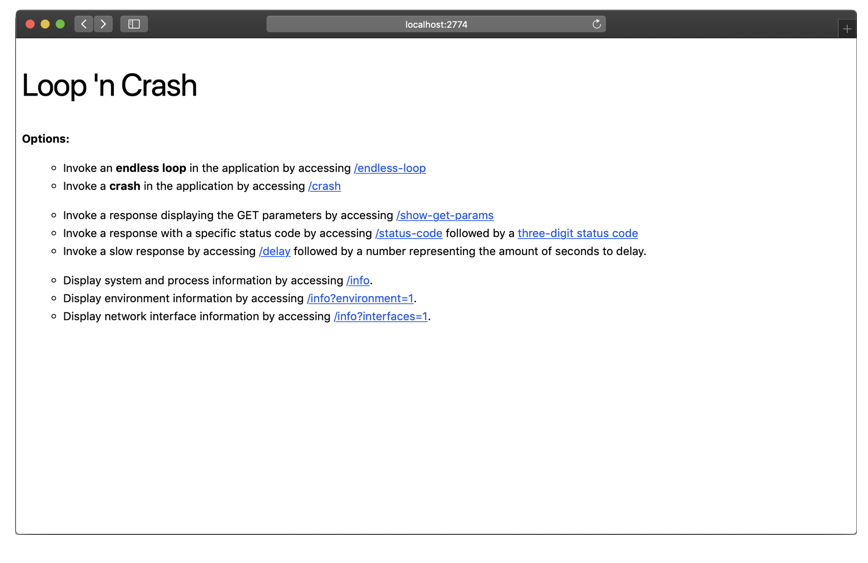

# Loop and Crash

> This repository is a [Express-based](https://expressjs.com) server that provides _endless loops_ and _crashes_, as a service. As a bonus feature, you can output client-requested status codes and slow-responding pages, too.

## Table of Contents

- [Requirements](#requirements)
- [Dependencies](#dependencies)
- [Usage](#usage)
- [Author Information](#author-information)
- [License](#license)

## Requirements

This repository requires Node.js version `4.x` or newer.

## Dependencies

This repository has no external dependencies, other than the packages listed in `package.json`.

## Usage

Start by cloning this [repository](https://github.com/operatehappy/loop-and-crash), then change into the freshly-cloned directory (usually named  `loop-and-crash`) and install any dependencies using the `npm install` command.

Next, start the application by running `npm start` and open [localhost:2774](http://localhost:2774/) in a browser.

Once the page loads, you will be presented with a list of options supported by _Loop and Crash_:

## Author Information

This module is maintained by the contributors listed on [GitHub](https://github.com/operatehappy/loop-and-crash/graphs/contributors)

Development of this module was sponsored by [Operate Happy](https://github.com/operatehappy).

## License

Licensed under the Apache License, Version 2.0 (the "License").

You may obtain a copy of the License at [apache.org/licenses/LICENSE-2.0](http://www.apache.org/licenses/LICENSE-2.0)

Unless required by applicable law or agreed to in writing, software distributed under the License is distributed on an _"AS IS"_ basis, without WARRANTIES or conditions of any kind, either express or implied.

See the License for the specific language governing permissions and limitations under the License.
